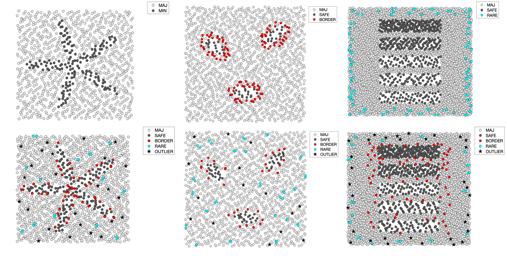

[](https://github.com/dwyl/esta/issues)


# Generic Multidimensional Data Generator
**Disclaimer of Authorship:** This repository has been forked from [this public project](https://github.com/sysmon37/datagenerator), and describes the design, implementation and usage of the data generator used in [1]. My contributions are as follows:

* Providing the generator's documentation in English, so that more researchers are able to understand and configure it;
* Providing a set of `MatLab` modules to read the `.arff` files created by the generator and visualizing the corresponding data typology (binary-classification, 2-dimensional datasets);
* Providing a collection of artificial datasets with different degrees of complexity that researchers may consider in future experiments.

Researchers are welcome to contribute their own extensions and data. This documentation is based on [RAPORT-RB-16-14](https://github.com/miriamspsantos/datagenerator/blob/documentation/docs/raport-rb-16-14.pdf), which has also been translated to [REPORT-RB-16-14-EN](https://github.com/miriamspsantos/datagenerator/blob/documentation/docs/REPORT-RB-16-14-EN.pdf).

## Introduction
The generator of artificial multidimensional and multiclass imbalanced data was designed to prepare datasets for computational experiments that focused on the analysis of the influence of various data difficulty factors on the operation of preprocessing methods and classifiers. The first version of the data generator was developed in the scope of a master's thesis [2] and was limited to two-dimensional and two-class datasets. It also did not include the generation of all considered types of data points. Nevertheless, it allowed to conduct a series of experiments regarding data difficulty factors, as those described in [3,4], among others.

This documentation describes the design, implementation, and usage of the current version of the data generator, which comprises the following features:

* Generation of multidimensional and multiclass datasets (from a practical point of view, 3-4 classes and 3-10 conditional attributes corresponding to individual dimensions are used);

* Definition of classes consisting of one or more regions (meta-balls and meta-cubes) with the ability to create integumental regions that fill the space between regions (usually related to the majority class);

* Possibility of varying the relative distribution of points between regions, and controlling the "density" of points within each region (choosing one of two possible distributions – uniform and normal);

* Generation of minority examples of all types, as thoroughly described in [5]: *safe*, *borderline*, *rare*, and *outlier*:
    * **Safe:** Examples lying within individual regions and having a homogeneous neighborhood consisting mainly of points of the same class;
    * **Borderline:** Coastal examples lying on the periphery/border of individual regions and mixed with points from other classes;
    * **Rare:** Examples forming small disjuncts (consisting of 2-3 examples) lying far from the regions that make up the class: they represent rare but correct observations;
    * **Outlier:** Single examples that are far from other examples of the same class, corresponding to "standing-out/thrown" examples.

* Generation of training/test sets, maintaining the location of *rare* and *outlier* points (i.e., in a given train/test pair, they appear in similar locations).

The generator has been implemented in `Java` and enables data to be saved in the `.arff` format.

## How to start the generator
The lastest compiled version of the generator () with the necessary libraries can be found in the `experiments` folder. The generator does not have a specialized user interface - it needs to be called from the command line. To run the project from the command line, go to the `experiments` folder and
type the following:

```shell
java -jar DataGenSW.jar -config <configuration_file>
```

The `config-files` folder contains several configuration files that can be used to give a quick start to the generator. For example:

```shell
java -jar DataGenSW.jar -config config-files/paw3-2d.conf
```
In case of correct operation, the generator will display a short report with a list of generated files:

```shell
[main] INFO pl.poznan.put.cs.idss.generator.Generator - Generating data set(s)
[main] INFO pl.poznan.put.cs.idss.generator.Generator - Pass 1...
[main] INFO pl.poznan.put.cs.idss.generator.Generator - Learning set
[main] INFO pl.poznan.put.cs.idss.generator.ARFFWriter - Saving ARFF file paw3-2d.arff...
```

## Configuration Parameters
The generator's operations are controlled by a set of parameters passed in the configuration file and/or in the command line (parameters can be defined in both, although the values from the command line override the values in the configuration file). This section describes the basic information regarding the generator's configuration parameters. For additional details please see the [REPORT-RB-16-14-EN](https://github.com/miriamspsantos/datagenerator/blob/documentation/docs/REPORT-RB-16-14-EN.pdf) and [Generator-Parameters.xls]().

As an example, the configuration file of `paw3-3d` is shown below. This is a binary-class, two-dimensional dataset, composed of 3 regions of the minority class resembling a paw print, and an integumental region of the majority class, filling the remaining space. As established in `class.1.exampleTypeRatio = 40:20:30:10`, the minority class has 40% *safe*, 20% *borderline*, 30% *rare*, and 10% *outlier* points.

```shell
# paw3-2d
attributes = 2
classes = 2

classRatio = 1:9
minOutlierDistance = 1

defaultRegion.weight = 1
defaultRegion.distribution = U
defaultRegion.borderZone = 1
defaultRegion.noOutlierZone = 1.5
defaultRegion.shape = C
defaultRegion.radius = 2, 1

defaultClass.exampleTypeRatio = 100:0:0:0

class.1.exampleTypeRatio = 40:20:30:10
class.1.regions = 3
class.1.region.1.center = 5,5
class.1.region.1.rotation = 1, 2, 45
class.1.region.2.center = -5,3
class.1.region.2.rotation = 1, 2, -45
class.1.region.3.center = 0,-5

class.2.regions = 1
class.2.region.1.shape = I
class.2.region.1.center = 0,0
class.2.region.1.radius = 10, 10

examples = 1500
fileName = paw3-2d.arff
exampleTypeLabels.classes = 1
```

A list of parameters and their basic description is as follows:

|Parameter|Description|
|---------|-----------|
|attributes|Number of attributes.<br>`attributes = 2`|
|classes|Number of classes.<br>`classes = 2`|
|names.classes|List of names of decision classes (comma-separated character strings).<br>`names.classes = MIN, MAJ`|
|names.attributes|List of names of the attributes (comma-separated character strings).<br>`names.attributes = A1, A2`|
|names.decision|Name of the decision attribute.<br>`names.decision = CLASS`|
|classRatio|Proportion of each class. They don't have to sum up to 1 or 100, the generator determines the proportion and converts it to the number of points in each class.<br>`classRatio = 1:9`|
|minOutlierDistance|Minimum distance between *rare* or *outlier* points belonging to one class, expressed in absolute terms (euclidean distance). The distance is not checked for *rare* points occuring in one "island" – they may appear very close to each other.<br>`minOutlierDistance = 1`<br><br>**Note:** For certain configurations (large number of rare and outlier points and long distances between them) the generator may not be able to generate points. If, after a certain number of attempts (currently 10,000), the generation of points fails, the generator stops. To solve this problem, reduce the value of the `minOutlierDistance` parameter.|
|defaultRegion.*|Grouping of default settings that can be shared by several regions. They can be overwritten for special regions.<br>`defaultRegion.shape = C`<br>`class.2.region.1.shape = I`
|defaultRegion.weight|The weight of a region determines what proportion of points from a given class should be included in the region. The sum of weights does not have to sum to 1 or 100, the generator automatically computes the number of points in each region.<br>`defaultRegion.weight = 1`|
|defaultRegion.shape|The shape of the region allows values C, R and I. C (circle) means meta-balls, R (rectangle) means meta-cubes and I (integumental) is a special case of a meta-cube, where the empty space is filled (usually with the majority class). Points from type I cannot appear in the core C and R regions. Also, type I regions cannot be rotated and cannot contain borderline, rare or outlier points. In other words, type I regions can only be defined for classes that contain only safe points.<br>`defaultRegion.shape = C`|
|defaultRegion.distribution|Distribution of points in a given region, allowing values U (uniform) and N (normal). If nothing is specified, U is used. In the case of normal distribution (N) it is possible to indicate the number of standard deviations in the region by adding a value after the N (e.g., "N, 3"). Number of standard deviations is optional: if it is not explicitly stated, it is assumed to be 1.0. This setting only applies to *safe* point: *borderline* points are generated using a uniform distribution (U). Regions of type I also ignore this setting (U distribution is used).<br>`defaultRegion.distribution = U`|
|defaultRegion.center|The center of the region, given as a list of real numbers (must be equal to the number of attributes).<br>`class.1.region.2.center = -5,3`|
|defaultRegion.border|Method to calculate region dimensions for areas containing safe and borderline points. Possible values are **fixed** and **auto**. The **fixed** value means that the generator uses the values of the **radius** and **borderZone** parameters (described below) given by the user and they are not modifiable in any way. On the other hand, the **auto** value means that the generator determines the dimensions of the areas for the *safe* and *borderline* points automatically, based on the order of point types (**exampleTypeRatio** parameter described below). The **radius** values are used as baseline values for the region sizes, and the method of their conversion is described in [REPORT-RB-16-14-EN](https://github.com/miriamspsantos/datagenerator/blob/documentation/docs/REPORT-RB-16-14-EN.pdf).|
|defaultRegion.radius|The size of the region given as radii for the C regions and half of the side lengths for R and I regions. They are given as a list of real numbers, the length of the list must be equal to the number of attributes. If the **border** parameter is **fixed** (no conversion), this area is the "core" of the region - this is where safe objects are placed. If **border = auto**, the area contains *safe* and *borderline points*.<br>`class.2.region.1.radius = 10, 10`|
|defaultRegion.borderZone|Absolute width of the boundary of the area in which borderline points can be placed (must be a value > 0 if the borderline points are to appear in the class to which the area belongs). There is only one value for all attributes: this value is required if **border=fixed**, otherwise it is ignored.|
|defaultRegion.noOutlierZone|Absolute width of a zone in which *rare* and *outlier* points cannot appear. This zone is located around the zone with *borderline* points. More information on [REPORT-RB-16-14-EN](https://github.com/miriamspsantos/datagenerator/blob/documentation/docs/REPORT-RB-16-14-EN.pdf).<br>`defaultRegion.noOutlierZone = 1.5`|
|defaultRegion.rotation|The rotation of a region is defined by selecting two dimensions (unique indexes counted from 1) and an angle expressed in degrees. Multiple rotations can be defined for one region - either by one entry containing several triple digits, or by multiple entries. If the rotation is not defined, the regions are not rotated.<br>`class.1.region.1.rotation = 1,2,45`|
|defaultClass.*|Grouping of default settings for all decision classes - a similar solution to `defaultRegion`, which avoids that the same settings are repeatedly defined.|
|defaultClass.exampleTypeRatio|Classify points in a given class as four real numbers separated by a character ":". Successive numbers indicate points of type safe, borderline, rare and outlier. They do not have to sum to 1 or 100 - the generator determines the proportions and then sets the appropriate number of points. If the class is to contain type I regions, all objects belonging to it must be of type safe. If not specified, a 100:0:0:0 configuration (safe objects only) is used.<br>`defaultClass.exampleTypeRatio = 100:0:0:0`|
|class.i.region.j.*|The definition of the jth region of the ith class overrides and replaces the default settings for the defaultRegion.<br>`class.1.region.1.center = 5,5`|
|class.i.regions|Number of regions on the ith class.<br>`class.1.regions = 3`|
|class.i.*|Properties of ith class that overrides and replaces the default settings entered for defaultClass.<br>`class.2.region.1.shape = I`|
|examples|Total number of points in the entire dataset, i.e., in all decision classes and regions.<br>`examples = 1500`|
|exampleTypeLabels.classes|Indication of decision classes for which labels indicating the type of data point are to appear in the generated dataset (labels are created by joining the class name with the name of the point type, e.g., MIN-BORDER). Classes for which different types of examples are to be generate should be indicated by specifying their indexes. If not specified, only the decision class labels will be written in the resulting dataset (without the types of individual points). To generate data for typical experiments, omit this setting. These labels are used for more detailed visualization and verification of generated collections of examples.<br>`exampleTypeLabels.classes = 1`|
|fileName|The filename (in `.arff` format) to which the generated data will be saved. Required if only one file is to be generated (i.e., if the `learnTestPairs` parameter is not provided).<br>`fileName = paw3-2d.arff`|
|learnTestRatio|Distribution of points between training and test sets, expressed as a pair of numbers separated by a character ":". The individual values do not have to sum to 1 or 100 - the generator calculates the proportions and defined the appropriate number of points. If not given, only training sets are generated (i.e., a 100:0 ratio is defined).<br>`learnTestRatio = 2:1`|
|learnTestPairs|Number of training/test pairs. If not specified, only the training set is generated. If the `learnTestRatio` parameter is given and the `learnTestPairs` is omitted, then the generator will report an error and stop running.<br>`learnTestPairs = 5`|
|fileName.learn|Template for the name of the training sets. It should contain the suffix `-%d` which will be replaced by consecutive indexes from 1 to `learnTestPairs`. It is mandatory if the `learnTestRatio` is given, otherwise it can be omitted.<br>`fileName.learn = paw3-2d-learn-%d.arff`|
|fileName.test|Template for the name of the test sets. It should contain the suffix `-%d` which will be replaced by consecutive indexes from 1 to `learnTestPairs`. It is mandatory if the `learnTestRatio` is given, otherwise it can be omitted.<br>`fileName.test = paw3-2d-learn-%d.arff`|


## Visualization
The `.arff` files generated can be analysed in several data analysis tool, such as WEKA.  
I've added some `MatLab` modules that can be used to read the `.arff` files, plot the data, and analyse the data typology of the minority class (*safe*, *border*, *rare*, and *outlier* examples).

In the current version, it is assumed that class `1` corresponds to the minority class, whereas `2` corresponds to the majority. Only binary-classification is considered and data typology is only analysed for the minority class. Therefore, it is assumed that the class attribute created by the data generator respects one of the following formats:

```
@attribute CLASS {MIN,MAJ}
@attribute D {1,2}
@attribute LABEL {1-SAFE,1-BORDER,1-RARE,1-OUTLIER,1-DEFAULT,2}
@attribute LABEL {MIN-SAFE,MIN-BORDER,MIN-RARE,MIN-OUTLIER,MIN-DEFAULT,MAJ}
```
If the data is two- or three-dimensional, the data is plotted in 2D/3D. If the number of attributes/features is higher than 3, then Principal Component Analysis (PCA) is performed, and data is plotted in 2D. If `savePlot` is activated, the code will store a `.png` of the respective datastet.

```matlab
clear all, clc
addpath('arff-to-mat');
addpath('datasets');

savePlot = 0 % do not save plot
% savePlot = 1 % save plot

plotDataTypes('paw3-2d.arff', savePlot);

```
Below are some visualizations of datasets created using the data generator. Configuration files are available at `experiments/config-files` and corresponding datasets are in `visualization/datasets`.



## Additional Information
Additional information regarding the data generation (design and implementation details, main packages and classes, scheme of generator operations) is based on [RAPORT-RB-16-14](https://github.com/miriamspsantos/datagenerator/blob/documentation/docs/raport-rb-16-14.pdf), and translated to [REPORT-RB-16-14-EN](https://github.com/miriamspsantos/datagenerator/blob/documentation/docs/REPORT-RB-16-14-EN.pdf). A list of parameters, their description, possible values, requirements, and example of use is also provided, for ease of use ([Generator-Parameters.xls]()).


## References
1. [Wojciechowski, S., & Wilk, S. (2017). Difficulty factors and preprocessing in imbalanced data sets: an experimental study on artificial data. Foundations of Computing and Decision Sciences, 42(2), 149-176.](https://sciendo.com/article/10.1515/fcds-2017-0007)
2. K. Kaluzny. Metody dekompozycji w analizie niezrównowazonych liczebnie danych. praca magisterska, 2009. (K. Kaluzny. Methods of decomposition in the analysis of imbalanced data. Master Thesis, 2009.)
3. [Napierala, K., Stefanowski, J., & Wilk, S. (2010). Learning from imbalanced data in presence of noisy and borderline examples. In International conference on rough sets and current trends in computing (pp. 158-167). Springer, Berlin, Heidelberg.](https://link.springer.com/chapter/10.1007/978-3-642-13529-3_18)
4. [Stefanowski, J. (2013). Overlapping, rare examples and class decomposition in learning classifiers from imbalanced data. In Emerging paradigms in machine learning (pp. 277-306). Springer, Berlin, Heidelberg.](https://link.springer.com/chapter/10.1007/978-3-642-28699-5_11)
5. [Napierala, K., & Stefanowski, J. (2016). Types of minority class examples and their influence on learning classifiers from imbalanced data. Journal of Intelligent Information Systems, 46(3), 563-597.](https://link.springer.com/article/10.1007/s10844-015-0368-1)

